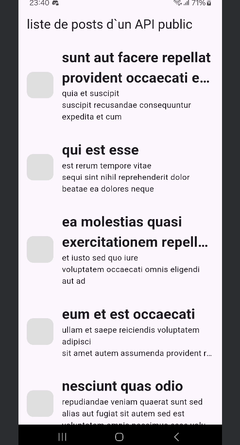

# Mini Projet Flutter – API REST (JSONPlaceholder)



##  Description
Ce projet est une application Flutter simple qui consomme l’API publique **[JSONPlaceholder](https://jsonplaceholder.typicode.com/)** pour afficher, créer, mettre à jour et supprimer des posts.  
C’est un excellent exemple pour apprendre à manipuler les méthodes HTTP (`GET`, `POST`, `PUT`, `DELETE`) avec le package `http` dans Flutter.

## Fonctionnalités
- **GET** : Récupérer et afficher une liste de posts
- **POST** : Ajouter un nouveau post
- **PUT** : Modifier un post existant
- **DELETE** : Supprimer un post
- Interface simple et responsive

## Technologies utilisées
- **Flutter** (SDK)
- **Dart**
- **http** (package pour les requêtes REST)
- **JSONPlaceholder API**

## Installation et exécution

1. **Cloner le projet**
```bash
git clone https://github.com/Abdelkerim516/Rest_API-avec-Flutter.git
cd Rest_API-avec-Flutter

